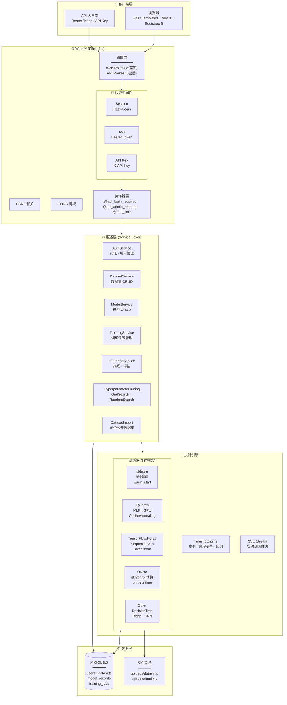
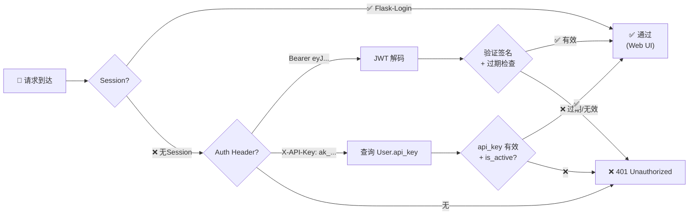
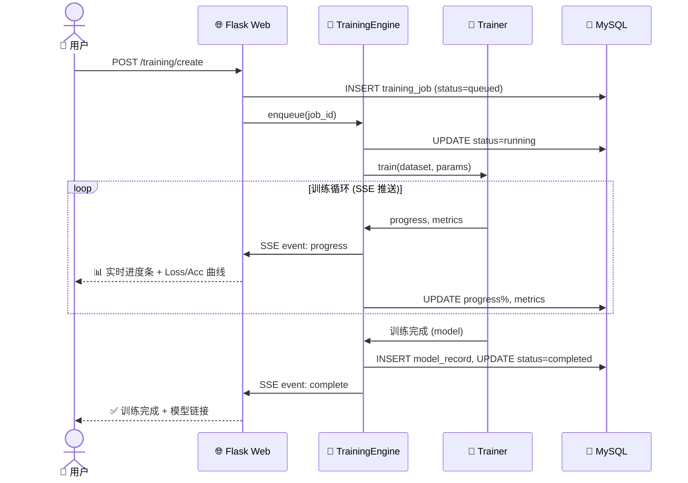
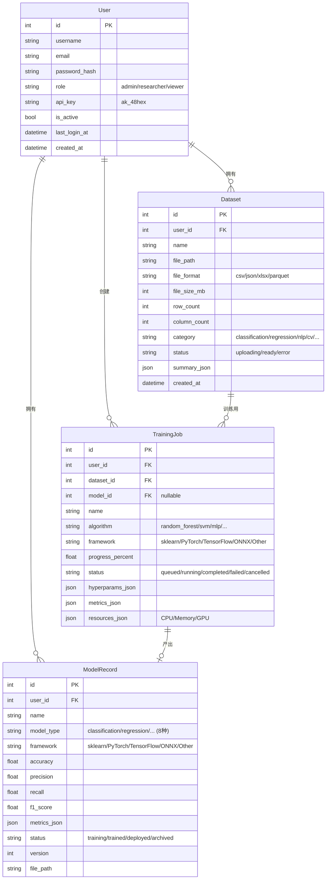

# AI Model & Dataset Management Platform — 项目架构文档

> **版本**: v2.0 | **日期**: 2026-06-03 | **技术栈**: Flask 3.1 · Vue 3 · Element Plus · Bootstrap 5 · MySQL · PyTorch · TensorFlow

---

## 1. 系统全景架构



---

## 2. 目录结构

```
myfirstaiproject/
├── run.py                          # 应用入口
├── config.py                       # 多环境配置 (dev/test/prod)
├── requirements.txt                # Python 依赖
├── ARCHITECTURE.md                 # 📄 本文档
│
├── app/
│   ├── __init__.py                 # Flask 应用工厂 · 蓝图注册 · CSRF配置
│   │
│   ├── models/                     # 📊 数据模型 (SQLAlchemy ORM)
│   │   ├── user.py                 #   User: id, username, role, api_key
│   │   ├── dataset.py              #   Dataset: file_path, format, category
│   │   ├── model_record.py         #   ModelRecord: framework, metrics, status
│   │   └── training_job.py         #   TrainingJob: progress, SSE, resources
│   │
│   ├── routes/                     # 🌐 Web 页面路由
│   │   ├── auth.py                 #   /auth/login, register, logout, profile
│   │   ├── dashboard.py            #   /dashboard (仪表盘·管理面板)
│   │   ├── datasets.py             #   /datasets (上传·导入·详情)
│   │   ├── models.py               #   /models (列表·对比·排行榜·测试)
│   │   ├── training.py             #   /training (创建·监控·超参数调优)
│   │   └── api/                    # 🔌 RESTful API 路由
│   │       ├── auth.py             #   /api/auth (JWT 登录·刷新·me)
│   │       ├── datasets.py         #   /api/datasets (公开数据集导入)
│   │       ├── models.py           #   /api/models (预测·评估·特征重要性)
│   │       ├── training.py         #   /api/training (超参数搜索·运行)
│   │       ├── stream.py           #   /api/stream (SSE 实时推送)
│   │       └── users.py            #   /api/users (CRUD·角色·API Key)
│   │
│   ├── services/                   # ⚙️ 业务逻辑层
│   │   ├── auth_service.py         #   认证 (login, JWT, refresh, API Key)
│   │   ├── dataset_service.py      #   数据集管理
│   │   ├── model_service.py        #   模型管理
│   │   ├── training_service.py     #   训练任务调度
│   │   ├── inference_service.py    #   模型推理·评估·特征分析
│   │   ├── hyperparameter_tuning.py #  超参数自动调优 (Grid/Random CV)
│   │   └── dataset_import_service.py # 15个公开数据集导入
│   │
│   ├── executor/                   # 🚀 训练执行引擎
│   │   ├── engine.py               #   单例引擎 · 线程管理 · 跨线程DB
│   │   └── trainers/               #   训练器 (策略模式)
│   │       ├── base.py             #     BaseTrainer (模板方法)
│   │       ├── sklearn_trainer.py  #     8种算法: RF·LR·SVM·KNN·DT·Ridge等
│   │       ├── pytorch_trainer.py  #     MLP: Dense·ReLU·BN·Dropout·GPU
│   │       └── keras_trainer.py    #     TensorFlow/Keras Sequential
│   │
│   ├── utils/                      # 🛠 工具模块
│   │   ├── decorators.py           #   @api_login_required · @rate_limit
│   │   ├── auth_helpers.py         #   get_current_user (3种认证)
│   │   ├── jwt_helpers.py          #   JWT 生成·验证·刷新
│   │   └── helpers.py              #   通用工具函数
│   │
│   ├── templates/                  # 🖼 Jinja2 模板
│   │   ├── base.html               #   基础布局 (含Vue 3 + Element Plus CDN)
│   │   ├── index.html              #   首页 (工作流程·核心功能)
│   │   ├── dashboard.html          #   仪表盘 (统计·图表·最近记录)
│   │   ├── admin.html              #   管理面板
│   │   ├── login.html / register.html / profile.html
│   │   ├── datasets/               #   数据集页面
│   │   ├── models/                 #   模型页面 (列表·详情·对比·排行榜·测试)
│   │   ├── training/               #   训练页面 (创建·详情·超参数调优)
│   │   ├── admin/                  #   管理页面 (用户管理)
│   │   └── errors/                 #   错误页面 (404·500)
│   │
│   └── static/                     # 🎨 静态资源
│       ├── css/style.css           #   全局样式 (含Element Plus兼容)
│       ├── js/main.js              #   通用脚本 (Toast·确认·动画)
│       └── js/el-enhance.js        #   Vue 3 + Element Plus 增强层
│
├── scripts/                        # 📜 运维脚本
│   ├── seed_data.py                #   初始化种子数据
│   ├── generate_datasets.py        #   生成合成数据集
│   ├── batch_train_v2.py           #   批量训练脚本
│   └── train_tf_onnx_other.py      #   TF/ONNX/Other 批量训练
│
├── tests/                          # 🧪 测试 (pytest)
│   ├── conftest.py                 #   Fixtures (app, client, test_user)
│   ├── test_auth.py                #   认证测试
│   ├── test_jwt_auth.py            #   JWT 认证测试 (20个)
│   ├── test_datasets.py            #   数据集测试
│   ├── test_models.py              #   模型测试
│   ├── test_training.py            #   训练测试
│   └── test_users_api.py           #   用户管理 API 测试
│
└── uploads/                        # 📁 上传目录
    ├── datasets/                   #   15个数据集 (CSV, 5-50MB)
    └── models/                     #   训练后的模型文件 (.pkl, .pt, .keras, .onnx)
```

---

## 3. 认证架构 (3种方式)



---

## 4. 训练流程 (SSE 实时推送)



---

## 5. 数据模型 ER 图



---

## 6. 前端技术栈

```
┌──────────────────────────────────────────────────────────────┐
│                    🖼 Jinja2 模板引擎                          │
│  ┌──────────────────────────────────────────────────────────┐│
│  │  🎨 Bootstrap 5.3 (布局/导航/卡片/表格)                   ││
│  │  ┌──────────────────────────────────────────────────────┐ ││
│  │  │  🟢 Vue 3 + Element Plus (UI 增强)                   │ ││
│  │  │  · el-backtop    回到顶部 (渐变色)                    │ ││
│  │  │  · el-message    消息通知 (替代 Bootstrap Toast)      │ ││
│  │  │  · el-empty      空状态                              │ ││
│  │  │  · el-skeleton   骨架屏加载                           │ ││
│  │  │  · el-progress   进度条增强                           │ ││
│  │  │  · el-tag        标签                                 │ ││
│  │  │  · el-alert      告警                                 │ ││
│  │  └──────────────────────────────────────────────────────┘ │
│  │  ┌──────────────────────────────────────────────────────┐ │
│  │  │  📊 Chart.js 4.4 (数据可视化)                        │ │
│  │  │  · 条形图 · 饼图 · 雷达图 · 散点图                   │ │
│  │  └──────────────────────────────────────────────────────┘ │
│  └──────────────────────────────────────────────────────────┘
└──────────────────────────────────────────────────────────────┘
```

---

## 7. API 路由总览

| 方法 | 路径 | 认证 | 说明 |
|------|------|------|------|
| **🔐 认证** | | | |
| POST | `/api/auth/login` | 无 | JWT 登录 → Token 对 |
| POST | `/api/auth/refresh` | 无 | 刷新 Access Token |
| GET | `/api/auth/me` | Bearer/APIKey | 当前用户信息 |
| **📊 数据集** | | | |
| GET | `/api/datasets/public` | 无 | 公开数据集列表 |
| POST | `/api/datasets/import/<key>` | Bearer/APIKey | 导入公开数据集 |
| **🤖 模型** | | | |
| POST | `/api/models/<id>/predict` | Bearer/APIKey | 模型预测 |
| POST | `/api/models/<id>/evaluate` | Bearer/APIKey | 模型评估 |
| GET | `/api/models/<id>/feature-importance` | Bearer/APIKey | 特征重要性 |
| **🎯 训练** | | | |
| GET | `/api/training/tuning/search-space` | Bearer/APIKey | 获取搜索空间 |
| POST | `/api/training/tuning/run` | Bearer/APIKey | 执行超参数调优 |
| **👥 用户管理** | | | |
| GET | `/api/users` | Admin | 用户列表 |
| GET/PUT/DELETE | `/api/users/<id>` | Admin | 用户 CRUD |
| PUT | `/api/users/<id>/role` | Admin | 角色变更 |
| POST | `/api/users/<id>/api-key` | Admin | 重置 API Key |
| GET/PUT | `/api/users/me` | Bearer/APIKey | 当前用户资料 |
| **📡 实时** | | | |
| GET | `/api/stream/training/<id>` | Session | SSE 训练进度 |

---

## 8. 关键设计决策

| 决策 | 原因 |
|------|------|
| **Flask + Jinja2 (非 SPA)** | 快速开发、SEO 友好、低复杂度 |
| **Vue 3 CDN 混合模式** | 不引入构建工具链，轻量增强，不破坏现有架构 |
| **Element Plus CSS 在 Bootstrap 之前加载** | Bootstrap 布局优先，Element Plus 仅提供交互组件 |
| **3种认证方式共存** | 渐进迁移：Session (Web) + JWT (新API) + APIKey (兼容) |
| **单例 TrainingEngine** | 线程安全、全局队列管理、避免资源竞争 |
| **策略模式 Trainer** | 5种框架统一接口，新增框架无需改引擎代码 |
| **SSE (非 WebSocket)** | 单向推送足够、实现简单、Flask 原生支持 |
| **PyJWT sub 存字符串** | PyJWT 2.10+ 强制要求 `sub` 为字符串类型 |

---

## 9. 平台统计 (截至 2026-06-03)

| 维度 | 数据 |
|------|------|
| **已训练模型** | 113 个 |
| **支持框架** | 5 种 (sklearn · PyTorch · TensorFlow · ONNX · Other) |
| **模型类型** | 8 种 (分类·回归·聚类·NLP·CV·RL·生成·其他) |
| **可用数据集** | 15 个 (3-50MB, 15K-50K 行) |
| **sklearn 算法** | 8 种 (RF·LR·SVM·KNN·GB·DT·Ridge·KNN-R) |
| **API 端点** | 20+ |
| **测试覆盖** | 77 个测试 · 0 失败 |
| **最佳模型** | 分类 99.2% · 聚类 100% · RL 97.2% |
